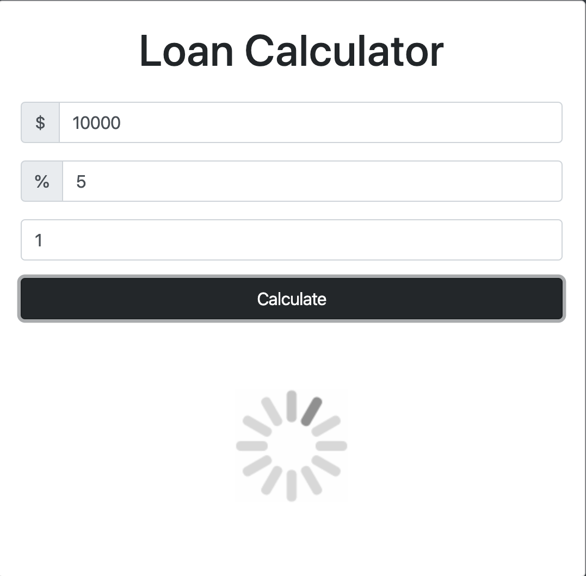
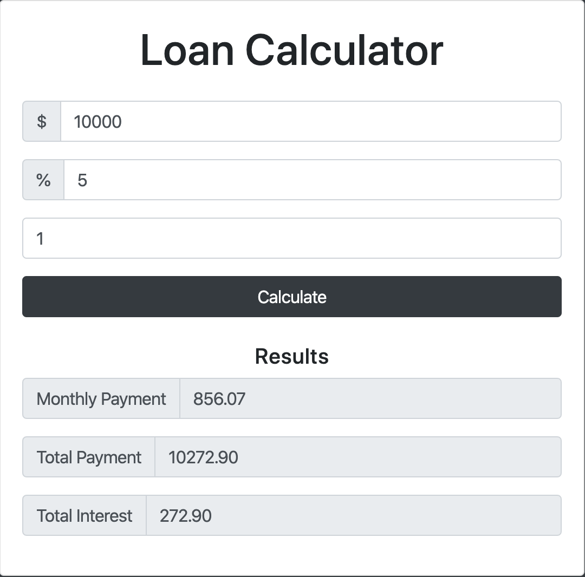

# Loan Calculator
This is written with Javascript and HTML

## Use
Clone repository and double click on index.html. (space)

Step 1: Enter principal amount. (space)
Step 2: Enter interest rate in percentage without the percentage sign. (space)
(see picture for example). (space)
Step 3: Enter years untul repayment. (space)
Step 4: Click 'Calculate'. (space)

