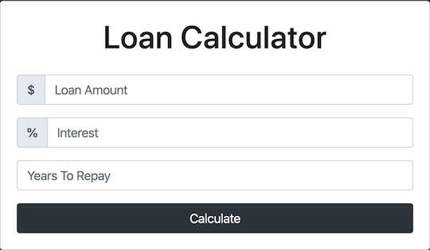

# Loan Calculator
This is written with Javascript and HTML

#Use
Clone repository and double click on index.html

Step 1: Enter principal amount
Step 2: Enter interest rate in percentage without the percentage sign
(see picture for example)
Step 3: Enter years untul repayment
Step 4: Click 'Calculate'

